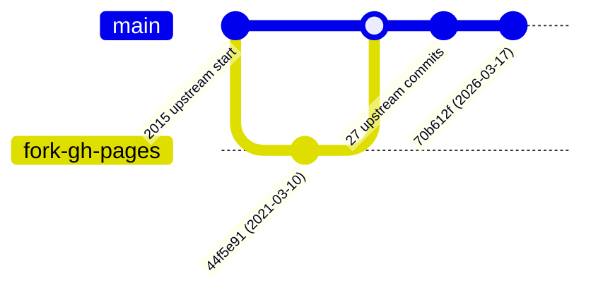

# Fork and upstream

## What this repository is

| | |
|---|---|
| GitHub | `TransLution/sqlstyle.guide`, public, a fork of `treffynnon/sqlstyle.guide` |
| Default branch | `main` (since 2026-10-05; previously `gh-pages`) |
| Content owner | Simon Holywell, upstream. CC BY-SA 4.0 (`LICENCE:3`) |
| TransLution content | none in the guide. TransLution owns only `reference/`, the agent files, the `.gitignore` header and the `exclude:` block in `_config.yml` |
| Published | no. GitHub Pages is not enabled on the fork; the live site is upstream's |

## Branches



*Edges from `git merge-base --is-ancestor 44f5e91 upstream/gh-pages` (true). The fork was
a strict ancestor of upstream, so `main` is the old `gh-pages` plus 27 upstream commits,
with nothing dropped.*

| Branch | State | Keep? |
|---|---|---|
| `main` | `70b612f` = `upstream/gh-pages` at creation; default; carries the TransLution artefacts | yes, the working line |
| `gh-pages` | `44f5e91`, the fork's frozen 2021 default | kept so the old default still resolves; nothing should target it |
| `master`, `nl-translation`, `patch-1`…`patch-4`, `robertopauletto-gh-pages` | inherited from upstream at fork time; see [F-05](../00-findings.md) | left in place |

## Why `main` and not `gh-pages`

Every other repository in the estate defaults to `main`, and the reference pattern
targets the default branch. Upstream publishes from `gh-pages` because GitHub Pages used
to require that name. The fork does not publish, so the name served no purpose.

If the fork is ever published, set the Pages source to `main` in the repository settings.
Do not push to `gh-pages`. Read [F-02](../00-findings.md) first.

## Syncing from upstream

The fork holds no content edits, so a sync should fast-forward everything except the
TransLution-owned paths. Do it on a branch, through a PR, like any other change:

```bash
git fetch upstream
git checkout -b chore/sync-upstream origin/main
git merge upstream/gh-pages
```

Expect conflicts in at most two places, both TransLution's and both deliberately kept
small:

- `_config.yml`: the `exclude:` block at the end of the file. Keep ours.
- `.gitignore`: the TransLution blocks above the
  `===== upstream … do not edit below this line =====` marker. Keep ours above the
  marker, and take theirs below it.

Then run `reference\_harness\Test-LanguageWiring.ps1`, because upstream adds languages,
and re-measure [02-translations.md](../02-site/02-translations.md).
