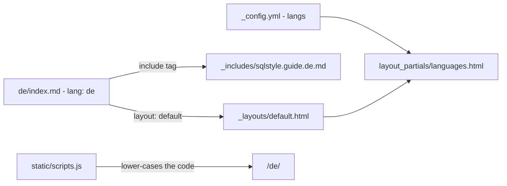

# Build and language wiring

## The build

The site is a static Jekyll site built by the `github-pages` gem (`Gemfile:2`), which pins
Jekyll 3 and its plugins. The configured plugins are `jekyll-redirect-from` and
`jekyll-sitemap` (`_config.yml:23`). Markdown is kramdown in GFM mode.

```bash
bundle install
bundle exec jekyll serve      # http://localhost:4040 (port from _config.yml)
```

`flake.nix` and `.envrc` give a Nix dev shell with Ruby, for anyone who uses direnv.
Neither is needed on Windows.

**Not run for this reference.** No Ruby was available on the machine that wrote it, so
the build has not been executed against `70b612f` or against the `exclude:` block
([F-03](../00-findings.md)).

## How a page is assembled



*Edges read from the files named. `de` stands for any language. English is the root
`index.md` including `_includes/sqlstyle.guide.md`.*

Each language page is a stub of about a dozen lines: front matter (`layout`, `lang`,
`lang_title`, contributors) and one include tag that pulls the whole guide in from
`_includes/`. The guide sources contain **no** front matter and no Liquid. They are plain
markdown.

## A language is four things that must agree

| # | Where | Rule | Evidence |
|---|---|---|---|
| 1 | `_config.yml`, `langs:` | a key per code, with the local name and the English name | `_config.yml:27` |
| 2 | `_includes/` | `sqlstyle.guide.<code>.md`; English is `sqlstyle.guide.md` | — |
| 3 | `<dir>/index.md` | front matter `lang: <code>`, and an include of (2) | — |
| 4 | the directory name | the **lower-case** of the code: `pt-BR` → `pt-br/`, `zh-TW` → `zh-tw/` | `scripts.js:15` builds the URL with `toLowerCase()` |

The language menu is built from **every page with a `lang` front-matter key**
(`languages.html:1`), not from `_config.yml`. So a stray `lang:` on any page puts a
phantom entry in the menu, and a page whose code is missing from `langs:` shows up with
a blank name.

Jekyll checks none of this. A broken piece produces a dead link or an empty label, not an
error. `_harness/Test-LanguageWiring.ps1` checks all four in both directions. It passed
for all 16 languages at `70b612f`.

`ja/index.md` also carries `redirect_from: "/jp"`, the only redirect in the site.
